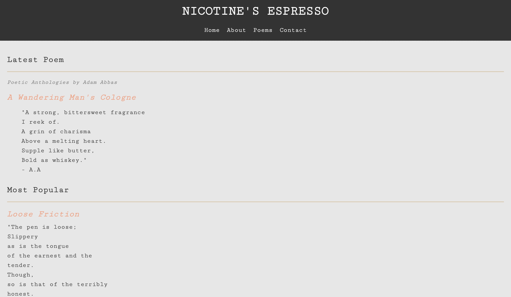

# Adam-Abbas---Poetry-Portfolio

# Nicotine's Espresso 
Welcome to my Poetry Portfolio GitHub repository! This repository serves as a collection of my personal poetry and quotes. It showcases my creative expression through captivating words and evocative imagery.

# Features
- Explore a diverse range of poems that delve into emotions, experiences, and introspection.
- Discover unique quotes that embody the power of language and leave a lasting impression.
- Enjoy a minimalistic and aesthetically pleasing web interface designed to enhance the reading experience.

# Technologies Used 
- HTML: Structure and layout of the web pages.
- CSS: Styling and visual presentation of the portfolio.
- Git: Version control to track changes and collaborate effectively.

Feel free to browse through the poems and quotes, savoring the emotions and imagery they evoke. I hope you find inspiration and a glimpse into my poetic world.
